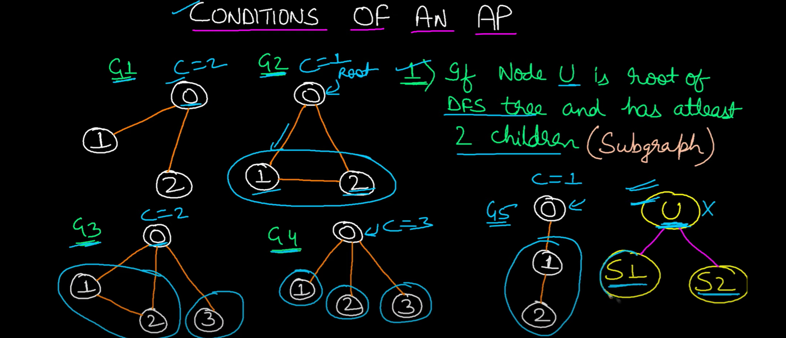
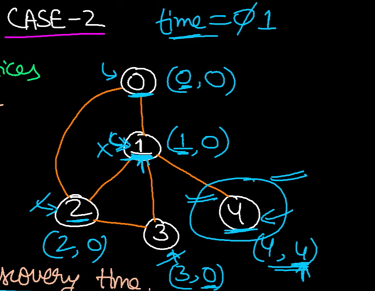

## Articulation Point

First read tarjan.md (Tarjan's algo to find strongly connected components)

Conditions of AP
    
    1. If node u is root of DFS tree and has atleast 2 children
    
    

    2. If node u is not root and atleast there's 1 child who does not have back-edge to ancestor of u 
        -- which means its separable

    low[v] >= disc[u]
    AP : 1 ---> low[4] >= disc[1] |  4 >= 1 
    Here node 4 is separable - has no back edge 
    Here node 2 is not separable - has back edge  

Maintain

    disc array -> all -1
    low array -> all -1
    parent array -> all -1
    isArticulationPoint array -> all false

    for each 
        if disc == -1 (if not discovered - run DFS)
            DFS(i,disc,low,parent,isArticulationPoint)

    DFS(u,disc,low,parent,isArticulationPoint):
        disc[u] = low[u] = time
        time++
        int noOfChildrens = 0
        
        for each v (neighbors) (u --> v) :
            if (v not discovered):
                {
                    noOfChildrens++;
                    parent[v] = u
                    DFS(v,disc,low,parent,isArticulationPoint)
                    low[u] = min(low[u],low[v])
                    
                    if(parent is root node &&  noOfChildrens > 1)       // CASE 1 - node is root of DFS tree and has >1 childrens
                        isArticulationPoint[u] = True

                    if(parent is NOT root node && low[v] >= disc[u])       // CASE 2 - node is not root and atleast there's 1 child who does not have back-edge to ancestor -- which means its separable
                        isArticulationPoint[u] = True 
                }
            else v discovered and is parent: 
                ignore - do nothing
            else v discovered and is ancestor:
                low[u] = min(low[u],disc[v])   ------> thats back edge (tarjan's algo)
            
        
    
