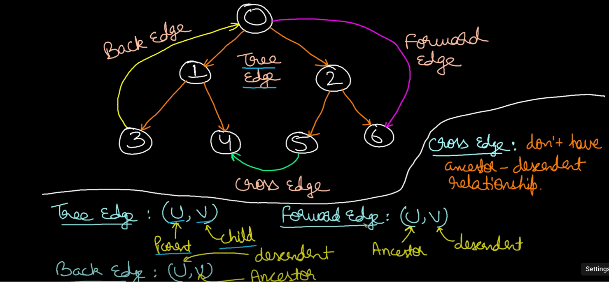
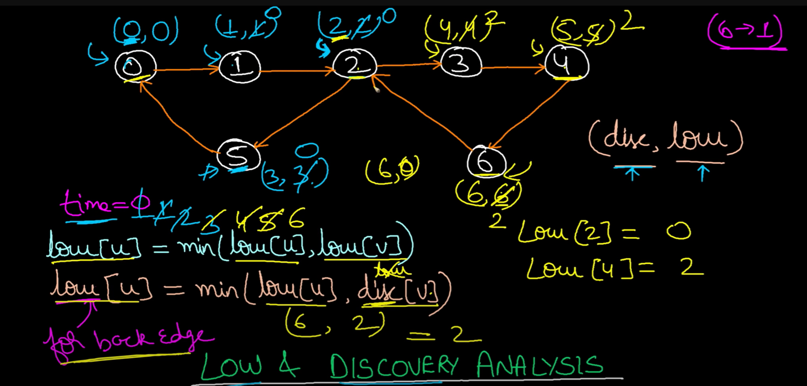

tree edge = Parent -> child

forward edge = Parent -> child's child

back edge = child -> parent/ancestor

cross edge = connecting to components (no ancestor decedent relation)

Algo's motive : to find strongly connected components (SCC)

Maintain following 

1. `discovery array` -> when a node was discovered
2. `Stack` -> to track nodes present in SCC
3. if you come across a node that is already visited (discovery non -1)
   1. either chance of `back edge` 
   2. or `cross edge`
   3. If the visited and `present in stack` ----> its a `back edge` ! else cross edge
   4. maintain `inStack` boolean array - to track above
4. low array -> node with lowest discovery time accessible
   1. for normal edges -> low[u] = min(low[u], `low`[v])
   2. for back edges -> low[u] = min(low[u], `disc`[v])
                                             ---XXX-> not low[v] becoz then it ll mean from u you can reach the ancestor of v 
                                             ------ as if you have 1 more back edge but you dont !!
   Example : 
   

here for node 2
    (disc[2],low[2]) = (2,0) 

here for node 6 
    low[6] = min(low[6],disc[2])  and not min(low[6],low[2]) 
           = min (6,2)         and not min (6,0)
                right                   wrong --> bcoz this would mean from 6 u have back edge to 0. 

Algorithm :
    
    disc -> all set to -1 
    low -> all set to -1
    stack -> empty
    inStack -> all false

    for each 
        if disc == -1 
            DFS(i,disc,low,stack,inStack)

    DFS(u,disc,low,stack,inStack)
        disc[u] = low[u] = time
        stack.push(u)
        inStack[u] = True
        time++
    
        for each neighbor of v (u --> v) { 
            v not discovered :
                DFS(v,..)
                low[u] = min(low[u],low[v])
            else v already discovered :
                if there is back edge (v presentInStack):
                    low[u] = min(low[u],disc[v])
        }
        
        after processing all neighbors 
        if low[u] == disc[u] :
            it is head of SCC
            for finding rest of the part of SCC:
            keep popping from stack until head is found 

Complexity:
    Simgle traverse 
    O(V+E)

